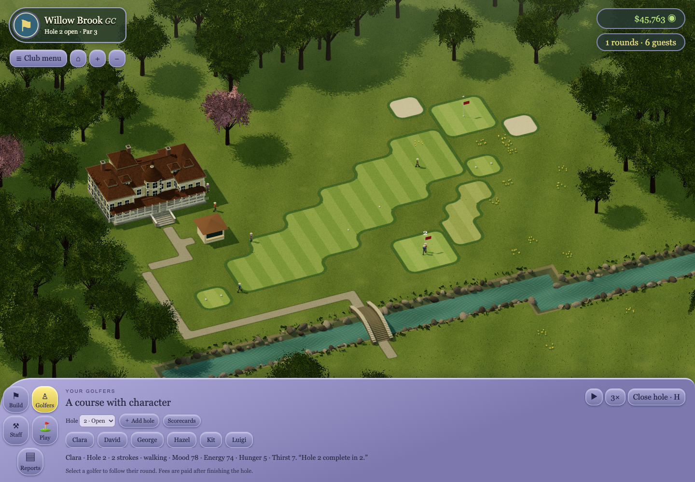

# SimGolf Reborn

**Build a golf course. Run the club. Play your own holes.**

SimGolf Reborn is a browser-based golf course management game inspired by **Sid Meier’s SimGolf**. Start with an empty property, shape the landscape, lay out holes and watch golfers put your design to the test. Use the income to improve the club, hire staff, add facilities and buy more land. Then step onto the course yourself.

The new **1.0.0 major rebuild** uses Three.js for a dimensional, isometric view with rounded tile shapes, green borders and a relaxed model-world feel.



## Start here

- **[Player guide: what the game is about and how to play](simgolf-reborn/PLAYER_GUIDE.md)**
- **[Download the v1.0.0 playable preview](https://github.com/hindfelt/simgolf/releases/tag/v1.0.0)**
- [Release notes and limitations](simgolf-reborn/RELEASE_NOTES.md)
- [Technical documentation](simgolf-reborn/DEVELOPMENT.md)

**[Play the browser preview at simgolfer.0x4d.in](https://simgolfer.0x4d.in/)**. Saves belong to each browser and hostname; export your local course and import it on the hosted site to continue. The release ZIP is also available for static hosting; it is not a Windows executable.

## What you do

1. **Design holes:** place tees and greens, paint fairways and bunkers, adjust elevations and connect walking paths.
2. **Open the course:** golfers arrive, play and pay fees. Their rounds and reactions help you judge your design.
3. **Run the club:** maintain the turf, deal with dandelions, hire staff and add amenities.
4. **Grow:** build more holes, buy adjoining land and sell home sites. Develop parkland, river-valley or coastal layouts.
5. **Play:** practise as your club professional or enter a local competition on your course. Export layouts for others to practise.

The challenge is to create an enjoyable, playable course that supports a thriving club. A difficult hole alone is not the whole objective: access, scenery, services and maintenance matter too.

## Run locally

Use Node.js 22 and npm. From the repository root:

```sh
cd simgolf-reborn/scene
npm ci
npm run dev
```

Open **http://localhost:4176/**. Start with **Build → Tee**, add a **Green**, connect access with **Path**, then select **Open hole**. See the player guide for a complete first round.

To build a static site:

```sh
npm run build
npm run preview
```

The output is `simgolf-reborn/scene/dist/`. Serve the contents of that folder. Saves are stored in each browser; export a save to move it between devices.

## Release status

**Playable preview, actively developed.** Version 1.0.0 marks the new implementation; it does not mean the full original game has been recreated.

Current features include up to 18 holes, terrain editing, bridges, tee directions, out-of-bounds stakes, ball flight/bounce/roll, persistent golfers, staff, resort facilities, home sales, land purchases, local competitions and course sharing. The release passed **417 local tests** and its production build.

Still in progress: full original progression and tuning, complete stories and celebrity residency, regional scenery, public hosting, cloud saves and actual multiplayer networking. Some costs and benefits are provisional.

The architecture is being prepared for cooperative course building, earnings competitions and multiplayer tournaments on user-built courses. **Those online modes are not available yet.**

## Project documentation

| Document | Purpose |
| --- | --- |
| [Player guide](simgolf-reborn/PLAYER_GUIDE.md) | Course building, playing, management, controls and saves |
| [Development guide](simgolf-reborn/DEVELOPMENT.md) | Setup, tests, build output and architecture overview |
| [Full specification](simgolf-reborn/whattobuild.md) | Intended recreation scope |
| [Backlog](simgolf-reborn/backlog.md) | Remaining work and implementation history |
| [Architecture](simgolf-reborn/architecture.md) | Simulation authority, saves and future multiplayer boundaries |
| [Graphics](simgolf-reborn/graphics/README.md) | Approved direction and visual reviews |

The active rebuild lives in **`simgolf-reborn/`**. Repository-root `src/`, `worker/` and the existing deployment workflow belong to the earlier implementation. See [legacy documentation](LEGACY_README.md) when working on that version. Its online features do not describe the new game.
